# QASL Framework

> **Q**uality **A**ssurance **S**hift-**L**eft
> Calidad construida desde el requerimiento, no parchada desde el defecto.

QASL es un framework metodológico **end-to-end** que une cinco disciplinas de testing — pruebas estáticas, E2E, API, performance y seguridad — bajo un único contrato operativo: **DoR/DoD encadenado entre actores**.

No es una colección de herramientas; es un **sistema de gates** donde el "Done" de un rol es el "Ready" del siguiente, y donde las decisiones de automatización se toman con datos (framework VCR), no con intuición.

---

## Visión

| | Enfoque tradicional | QASL |
|---|---------------------|------|
| Calidad nace en | Defectos en producción | Requerimientos del cliente |
| Test cases | Después del código | **Antes del código** (Shift-Left) |
| Decisión de automatizar | Intuición / manager | **Framework VCR cuantitativo** |
| Handoffs entre roles | Verbales, ambiguos | **DoR/DoD contratos blindados** |
| Visibilidad del PM | Status calls semanales | **Gap chart distribuido + master view** |
| Reportes | Aislados por herramienta | **Unificados en Grafana** |

---

## Metodología: DoR/DoD Encadenado

> Cada actor abre su DoR cuando recibe un input válido y cierra su DoD cuando entrega un artefacto verificable. **El DoD de una unidad ES el DoR de la siguiente.** Sin DoD cerrado no hay avance.

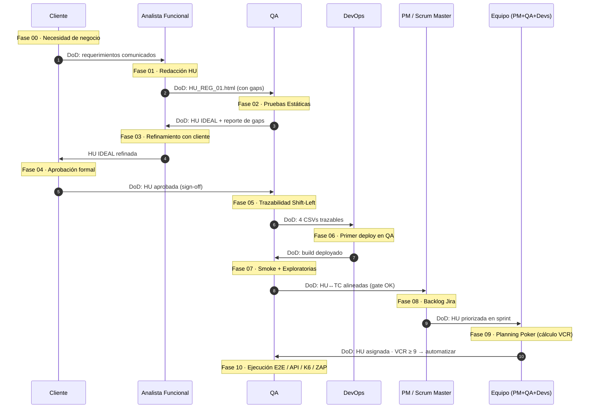

### Contratos DoR/DoD por actor

| # | Actor | DoR (entrada) | DoD (salida) | Artefacto |
|---|-------|---------------|--------------|-----------|
| 1 | Cliente | Necesidad de negocio | Requerimientos comunicados | Brief / sesiones |
| 2 | Analista Funcional | Requerimientos del cliente | HU original lista para QA | `HU_REG_01.html` |
| 3 | **QA — Pruebas Estáticas** | HU original recibida | HU IDEAL + reporte de gaps | `HU_REG_01_ACTUALIZADA.html` + `HU_REG_01_REPORT.md` |
| 4 | Analista Funcional (refinamiento) | HU IDEAL recibida | HU aprobada por cliente | HU IDEAL firmada |
| 5 | Cliente | HU IDEAL para revisión | Aprobación formal | Sign-off |
| 6 | **QA — Trazabilidad** | HU aprobada por cliente | 4 CSVs + Test Cases pre-código | `1..4_*.csv` |
| 7 | DevOps | Trazabilidad lista | Primer deploy en QA | Build deployado |
| 8 | **QA — Validación temprana** | Deploy disponible | Smoke + exploratorias OK | HU↔TC alineadas |
| 9 | PM / Scrum Master | HU validada | Ticket en backlog Jira | Ticket priorizado |
| 10 | Equipo (Planning Poker) | HU priorizada | Estimación VCR | VCR ≥ 9 → automatizar |
| 11 | **QA + Devs** | HU asignada al sprint | E2E / API / K6 / ZAP pasados | Reportes Allure / HTMLExtra / K6 / ZAP |

### Regla de oro

> **Cada actor produce su propio gap chart de DoR→DoD.** Al cierre del proyecto, todos los gap charts se consolidan en un **master view** que permite al PM ver desde arriba dónde se trabó el flujo. *(Capa de visualización en construcción.)*

---

## Marco Conceptual — DoR, DoD e INVEST

QASL toma dos prácticas estándar de Scrum/Agile (**DoR** y **DoD**) y las usa como contratos blindados entre roles. Para que el sistema funcione, la **HU original** que entrega el Analista Funcional debe cumplir el método **INVEST**.

### Definition of Ready (DoR)

> Criterios que un elemento del backlog (historia de usuario, defecto o épica) **debe cumplir antes de entrar a un sprint** o pasar al siguiente actor.

Garantiza que el trabajo esté **bien preparado y comprendido** antes de empezar. Sin DoR cumplido, no hay avance posible.

**Criterios típicos de DoR para una HU:**

- La HU está escrita siguiendo los criterios **INVEST**
- Los criterios de aceptación están definidos de forma clara y concisa
- Diseño o investigación previa completados
- Dependencias identificadas y abordadas
- Prioridad y valor comercial comprendidos

### Definition of Done (DoD)

> Criterios que deben cumplirse para que un elemento del backlog se considere **completado y potencialmente desplegable**.

Garantiza un nivel de calidad consistente en cada entrega.

**Criterios típicos de DoD para una HU:**

- Código escrito, revisado y con pruebas unitarias
- Criterios de aceptación funcionales pasados sin defectos mayores
- Elementos de UI diseñados e integrados
- Documentación actualizada
- Aprobación del Product Owner

### Método INVEST — Calidad de la HU original

Toda HU que entra al pipeline QASL debe cumplir los 6 atributos INVEST. Es el contrato del DoR de la **Fase 01 (Analista Funcional)**:

| Letra | Atributo | Significado |
|-------|----------|-------------|
| **I** | **I**ndependent | La HU puede desarrollarse sin depender de otras |
| **N** | **N**egotiable | El alcance puede discutirse y refinarse con el cliente |
| **V** | **V**aluable | Aporta valor concreto al usuario o al negocio |
| **E** | **E**stimable | El equipo puede estimar su esfuerzo |
| **S** | **S**mall | Se completa dentro de un sprint |
| **T** | **T**estable | Es posible verificar su cumplimiento (criterios de aceptación claros) |

### Aplicación en QASL — Ejemplo HU_REG_01

> *"Como visitante del e-commerce, quiero registrar una cuenta nueva para acceder a las funcionalidades de compra."*

**DoR de la HU (debe cumplir antes de entrar a Fase 02):**

- ✓ Formato Como/Quiero/Para correcto
- ✓ 4 BRs definidas (email único, password ≥ 6, campos obligatorios, mensaje de confirmación)
- ✓ INVEST: Independiente, Negociable, Valiosa, Estimable, Pequeña, Testable
- ✓ Dependencias técnicas identificadas (endpoint `POST /api/createAccount`)
- ✓ Precondiciones documentadas

**DoD de la HU (al cerrar Fase 10):**

- ✓ E2E (Playwright) cubre los 4 BRs en positivo + negativo
- ✓ API tests (Newman) validan el endpoint
- ✓ K6 confirma performance bajo carga
- ✓ OWASP ZAP no detecta vulnerabilidades High
- ✓ Métricas en Grafana
- ✓ Documentación actualizada
- ✓ HU con cobertura 100% (validada en Fase 02)
- ✓ Aprobada por el cliente (Fase 04)

> **El "Done" de un actor = el "Ready" del siguiente.** Sin DoD cerrado, no hay avance. Esa es la regla del framework.

---

## Framework VCR — Priorización Objetiva de Automatización

VCR es un framework de autoría propia para decidir **qué automatizar y qué probar manualmente**, basado en la norma **ISO 31000 — Gestión de Riesgos**.

> ⚠️ **Cuándo se calcula el VCR**
> El VCR se aplica **en la Fase 09 — Planning Poker**, donde el equipo completo (PM, Analista, QA, Devs) estima en conjunto. **No antes.**
>
> En la **Fase 05 (Trazabilidad)** el QA entrega los Test Cases pre-código pero **NO completa los campos VCR** del CSV `1_User_Storie.csv` — esos campos quedan vacíos hasta Planning Poker. Lo mismo aplica para `Estimacion_Original_Hrs`, `Tiempo_Empleado_Hrs`, `Requiere_Regresion` y `Es_Deuda_Tecnica`.

### Fórmula

```
VCR_Total = VCR_Valor + VCR_Costo + VCR_Riesgo

donde:
  VCR_Valor   = 1 a 3   (impacto de negocio)
  VCR_Costo   = 1 a 3   (costo de implementación)
  VCR_Riesgo  = Probabilidad × Impacto    (rango 1 a 9)
  VCR_Total   = rango 3 a 15
```

### Política (decisión automática del framework)

| VCR_Total | Es_Deuda_Tecnica | Requiere_Regresion | Decisión |
|-----------|:----------------:|:------------------:|----------|
| **≥ 9** | Sí | Sí | **Automatizar + Regresión** (ROI justificado) |
| **< 9** | No | No | **Pruebas manuales** (costo de automatizar excede beneficio) |

### Por qué el umbral es 9

Representa el **percentil 33 superior** del rango total (3-15), que en gestión de riesgos coincide con el "tier alto". Es ajustable por proyecto.

### Quién aplica el framework

| Fase | Actor | Acción sobre VCR |
|------|-------|------------------|
| 05 — Trazabilidad | QA | **No toca VCR** — campos en blanco en el CSV |
| 09 — Planning Poker | Equipo (PM + Analista + QA + Devs) | **Calcula VCR**, decide automatizar o manual, asigna |
| 10 — Ejecución | QA + Devs | Ejecuta según decisión: pipeline E2E/API/K6/ZAP (si VCR ≥ 9) o pruebas manuales (si VCR < 9) |

---

## Estándares Aplicados

Todas las decisiones del framework están alineadas a estándares públicos vigentes:

| Estándar | Aplicación en QASL |
|----------|---------------------|
| **ISTQB CTFL v4.0 (2023)** | Niveles, tipos y técnicas de prueba |
| **ISO/IEC/IEEE 29119-3:2021** | Test Documentation (reemplaza IEEE 829, derogada 2008) |
| **ISO/IEC/IEEE 29148:2018** | Requirements Engineering (reemplaza IEEE 830, derogada 2018) |
| **OWASP Top 10:2021** | Web Application Security Risks |
| **ISO 31000:2018** | Gestión de Riesgos (base del framework VCR) |
| **IEEE 1028-2008** | Software Reviews and Audits |

---

## Stack Tecnológico

| Capa | Herramienta |
|------|-------------|
| Pruebas estáticas | Python 3.8+ · BeautifulSoup · **Anthropic Claude AI** |
| E2E | Playwright + TypeScript |
| API | Newman (HAR → Postman → Newman) |
| Performance | K6 + InfluxDB |
| Seguridad | OWASP ZAP (Docker) |
| Observabilidad | Grafana · InfluxDB · Loki · Promtail |
| Reportes | Allure · HTMLExtra · K6 HTML · ZAP nativo |
| CI/CD | GitHub Actions · GitHub Pages |
| Notificaciones | Email (informe de avance basado en plantilla ISTQB) |

---

## Pipeline en 5 Fases

```
Fase 1   PRUEBAS ESTÁTICAS    →  HU IDEAL + Reporte de gaps
Fase 2   TRAZABILIDAD          →  4 CSVs (User Story · Test Suite · Precondition · Test Case)
Fase 3   E2E + API CAPTURE    →  Playwright + HAR → Newman
Fase 4   PERFORMANCE          →  K6 con métricas a Grafana
Fase 5   SEGURIDAD             →  OWASP ZAP baseline scan
                ↓
         GRAFANA (dashboard unificado)
                ↓
         Notificación email + Informe de avance + Regresión en GitHub Actions
```

---

## Estructura del Repositorio

```
QASL-Framework/
├── static_analyzer/             Fase 1: Pruebas Estáticas
│   ├── hu-originales/           Input — HUs del Analista Funcional
│   ├── hu-actualizadas/         Output — HUs IDEAL del analyzer
│   ├── reportes/                Output — reportes .md de análisis
│   ├── templates/               Plantilla maestra ISTQB
│   ├── parser.py
│   ├── rtm_analyzer_ai.py       Análisis semántico con Claude
│   ├── report_generator.py
│   ├── hu_ideal_html_generator.py
│   ├── run_analysis.py          ▶ Comando: pruebas estáticas
│   └── generate_traceability.py ▶ Comando: 4 CSVs con Claude
│
├── shift-left-testing/          Fase 2: 4 CSVs de trazabilidad
│   ├── 1_User_Storie.csv
│   ├── 2_Test_Suite.csv
│   ├── 3_Precondition.csv
│   └── 4_Test_Case.csv
│
├── e2e/                         Fase 3: Playwright + TypeScript
├── unit/                        Tests unitarios del framework
├── universal_recorder_pro.js    Grabador de tests con 11 niveles
├── scripts/                     Runners (E2E, API, K6, ZAP, demo)
├── scripts_metricas/            Senders a InfluxDB
├── docker/                      Grafana, Loki, Postgres, ZAP, etc.
├── docker-compose.yml
├── plantillas-istqb/            Plantillas ISTQB / ISO 29119
├── playwright.config.ts
├── vitest.config.ts
└── package.json
```

---

## Quick Start

### Pre-requisitos
- Python 3.8+
- Node.js 18+
- Docker Desktop
- API Key de Anthropic (https://console.anthropic.com/settings/keys)

### Instalación

```bash
# 1. Clonar repo
git clone https://github.com/E-Gregorio/QASL-Framework.git
cd QASL-Framework

# 2. Variables de entorno del Static Analyzer
cd static_analyzer
cp .env.example .env   # editar y pegar ANTHROPIC_API_KEY
pip install -r requirements.txt
cd ..

# 3. Dependencias Node
npm install

# 4. Levantar infraestructura (Grafana, InfluxDB, Loki, Postgres, ZAP)
docker-compose up -d
```

### Flujo Shift-Left en 2 ejecuciones

```bash
# EJECUCIÓN 1 — Pruebas Estáticas (Shift-Left fase 1)
cd static_analyzer
python run_analysis.py HU_REG_01

# Genera:
#   reportes/HU_REG_01_REPORT.md
#   hu-actualizadas/HU_REG_01_ACTUALIZADA.html

# ⏸  Etapa intermedia: el Analista refina la HU IDEAL con el cliente y la aprueba

# EJECUCIÓN 2 — Trazabilidad (Shift-Left fase 2)
python generate_traceability.py HU_REG_01

# Genera (en ../shift-left-testing/):
#   1_User_Storie.csv     (HU completa)
#   2_Test_Suite.csv      (TS01 positivos · TS02 negativos · TS03 seguridad)
#   3_Precondition.csv    (PRCs reutilizables)
#   4_Test_Case.csv       (TCs con pasos separados, modelo JIRA/Xray)
```

### Pipeline E2E completo (Fases 3-5)

```bash
npm run pipeline
# Equivale a: E2E (Playwright) → API (Newman) → K6 → ZAP
# Métricas se envían a Grafana automáticamente
```

---

## Comandos npm disponibles

| Comando | Acción |
|---------|--------|
| `npm run unit` | Tests unitarios del framework (Vitest) |
| `npm run e2e` | Tests E2E (Playwright) |
| `npm run e2e:capture` | E2E + captura de APIs en HAR |
| `npm run api` | Tests de API (Newman desde HAR) |
| `npm run k6` | Tests de performance (K6) |
| `npm run zap` | Scan de seguridad (OWASP ZAP) |
| `npm run pipeline` | Pipeline completo: E2E → API → K6 → ZAP |
| `npm run demo` | Demo automatizada end-to-end |
| `npm run dashboard` | Abre el Centro de Control en Grafana |
| `npm run infra:check` | Health check de la infraestructura (Loki) |
| `npm run docker:up` | Levantar todos los servicios Docker |
| `npm run docker:down` | Apagar servicios |

---

## Innovaciones de Autoría Propia

1. **Framework VCR** — Priorización cuantitativa de automatización basada en ISO 31000.
2. **DoR/DoD Encadenado entre actores** — Cada handoff es un contrato blindado, no una conversación verbal.
3. **Universal Recorder Pro** — Grabador de tests con 11 niveles de selectores y confidence score (vs. 5 niveles de Playwright Codegen).
4. **Unit Testing del código de automatización** — Validamos los helpers/generators del framework antes de correr E2E.
5. **Infrastructure Observability** — Logs centralizados de TODOS los containers de testing en un único dashboard (Loki + Promtail, ~350 MB RAM vs. 16-32 GB de ELK).

---

## Bitácora de avance · Estado actual

### ✅ Completado (Fases 0-9 del flujo Shift-Left + F10.1 E2E)

| # | Componente | Archivo / artefacto |
|---|------------|---------------------|
| 1 | **Pipeline Python ejecutable** | `static_analyzer/run_analysis.py` + `generate_traceability.py` |
| 2 | **HU original** (analista funcional, con gaps deliberados) | `static_analyzer/hu-originales/HU_REG_01.html` |
| 3 | **HU IDEAL** generada con Claude AI · cobertura 25%→100% | `static_analyzer/hu-actualizadas/HU_REG_01_ACTUALIZADA.html` |
| 4 | **Reporte de pruebas estáticas** (.md) con 5 gaps detectados | `static_analyzer/reportes/HU_REG_01_REPORT.md` |
| 5 | **4 CSVs de trazabilidad** generados con Claude AI | `shift-left-testing/{1_User_Storie, 2_Test_Suite, 3_Precondition, 4_Test_Case}.csv` |
| 6 | **10 gap charts DoR/DoD** (uno por fase, fuente de verdad del flujo) | `flow-state/00-cliente.json` … `flow-state/09-equipo---planning-poker.json` |
| 7 | **Plantilla maestra ISTQB** con `<th>` semántico | `static_analyzer/templates/plantilla-hu-istqb.html` |
| 8 | **Sistema flow_state.py** | `static_analyzer/flow_state.py` (`open_dor()` / `close_dod()`) |
| 9 | **Simulador de handoffs** para los 8 actores no-script | `static_analyzer/simulate_handoffs.py` |
| 10 | **Dashboard Master View** (estructura HTML + Gantt) — **pendiente refinamiento visual** | `flow-state-dashboard.html` |
| 11 | **README con DoR/DoD/INVEST + Framework VCR** | `README.md` |
| 12 | **F10.1 · Suite E2E Playwright + TypeScript** (20 TCs, trazabilidad 1:1 con CSV) | `e2e/specs/HU_REG_01.spec.ts` + `e2e/{locators,pages,test-base,utils}/` |
| 13 | **Plantilla de Informe de Defecto** alineada a ISTQB v4.0 + ISO/IEC/IEEE 29119-3:2021 + IEEE 1044-2009 + ISO/IEC 25010 + OWASP/CWE/CVSS | `plantillas-istqb/informe de defecto.md` |
| 14 | **BUG-001** detectado por la suite E2E (password sin validación de longitud mínima · CWE-521 · OWASP A07:2021) | `shift-left-testing/defects/BUG-001-password-min-length-not-validated.md` |
| 15 | **Reporte Allure HTML** (17 ✅ / 3 ❌ — los 3 fail = evidencia de BUG-001) | `reports/e2e/allure-report/index.html` |
| 16 | **20 archivos HAR** capturados durante E2E (insumo F10.2 Newman) | `.api-captures/*.har` |
| 17 | **F10.2 · Pipeline HAR → Postman Collection v2.1 → Newman + HTMLExtra** con asserts **estrictos** (74 requests / 148 assertions / **124 ✅ / 24 ❌** · los 24 fails son evidencia de Cloudflare bot protection, no defecto del framework) | `scripts/run-api.mjs` |
| 18 | **Postman Collection + Environment** importables (Postman GUI ready) | `reports/api/postman/{collection,environment}.json` |
| 19 | **Reporte HTMLExtra** dark-theme con timings, summary y trazabilidad por folder | `reports/api/htmlextra-report.html` |
| 20 | **F10.3 · Test K6 standalone con flujo dinámico de token** (4 groups: setup→auth→authd→teardown · 2 VUs · 30s) | `performance/HU_REG_01.k6.js` |
| 21 | **Orquestador K6** + generador HTML custom + sender InfluxDB | `scripts/run-k6.mjs` + `scripts/k6-html-report.mjs` + `scripts_metricas/send-k6-metrics.mjs` |
| 22 | **Reporte K6 HTML profesional fondo blanco** (KPIs + 4 gráficos Chart.js + 4 tablas · 20 iters / 80 reqs / 180/180 checks / 5/5 thresholds verdes) | `reports/k6/k6-report.html` |
| 23 | **F10.4 · OWASP ZAP Baseline Scan vía Docker** (`zaproxy/zap-stable`) — orquestador limpio, sin formato muerto, volume mount al host | `scripts/run-zap.mjs` |
| 24 | **Reportes nativos ZAP** HTML / JSON / Markdown · 26 hallazgos del SUT documentados (1 High, 5 Medium, 12 Low, 8 Info · 45 reglas pasadas) | `reports/zap/zap-report.{html,json,md}` |
| 25 | **F10.5 · Observabilidad consolidada** Grafana 11.4.0 + InfluxDB 1.8 + Loki + Renderer · dashboard QASL Quality Cockpit con 27 panels (4 capas + footer) sin emojis, naming F10.x corporativo | `docker/grafana/dashboards/qa-control-center.json` |
| 26 | **Orquestador único de métricas** `send-all-metrics.mjs` · lee 4 JSONs (E2E/API/K6/ZAP) y escribe en InfluxDB en una sola corrida sin re-ejecutar pruebas | `scripts_metricas/send-all-metrics.mjs` |
| 27 | **Helper InfluxDB compartido** con `sendK6Metrics` agregado · 4 senders standalone + 1 orquestador · todos contra `qa_metrics` database | `scripts_metricas/influx-client.mjs` + `scripts_metricas/send-{e2e,api,k6,zap}-metrics.mjs` |

### 🎯 F10.1 · Resultados de la ejecución E2E

> Suite ejecutada el **2026-05-01** contra `automationexercise.com` con Playwright 1.56 + Chromium · ejecución serial (1 worker) · `headless: false`.

**Métricas globales:**

| Métrica                    | Valor                                                               |
| -------------------------- | ------------------------------------------------------------------- |
| Test cases ejecutados      | **20** (TC-001 → TC-020)                                            |
| Pasaron                    | **17 (85%)**                                                        |
| Fallaron                   | **3** — todos atribuibles al mismo defecto (BUG-001)                |
| Defectos detectados        | **1** (BUG-001 · severidad S2-Crítica · CVSS 5.3)                   |
| Tiempo total de ejecución  | ~2 min 35 s                                                         |
| Trazabilidad TC↔CSV        | **1:1 verificada** (nombres del spec idénticos a `Titulo_TC` del CSV) |
| Cobertura de Test Suites   | TS01 (positivos · 6 TCs) · TS02 (negativos · 9 TCs) · TS03 (seguridad/integración · 5 TCs) |
| Métricas de trazabilidad por TC | TC_ID · TS_ID · PRC_Asociadas · Cobertura_Escenario · Cobertura_BR · Tecnica_Aplicada (visibles en Allure) |

**Vista general del reporte Allure:**

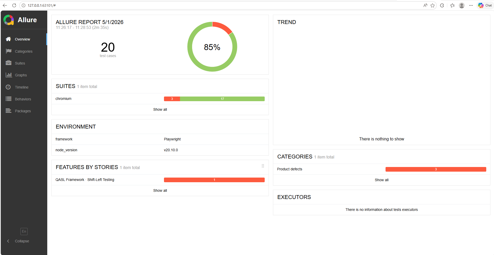

**Suite con trazabilidad TC + PRC + BR + escenarios visibles por test:**

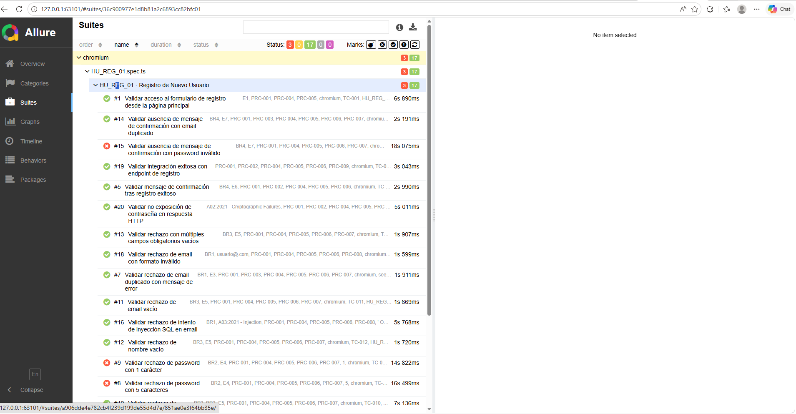

**Los 3 fallos confirmados como evidencia de BUG-001:**

| TC      | Título                                                                                  | Síntoma                                                                          |
| ------- | --------------------------------------------------------------------------------------- | -------------------------------------------------------------------------------- |
| TC-008  | Validar rechazo de password con 5 caracteres                                            | El SUT acepta el password de 5 chars y crea la cuenta (esperaba rechazo por BR2) |
| TC-009  | Validar rechazo de password con 1 carácter                                              | El SUT acepta el password de 1 char y crea la cuenta (esperaba rechazo por BR2)  |
| TC-015  | Validar ausencia de mensaje de confirmación con password inválido                       | El SUT muestra "Account Created!" con password de 5 chars (viola BR4)            |

> **Estos fallos NO son bugs del framework — son la evidencia de que la suite encontró un defecto real** del SUT. Documentados formalmente en el informe `BUG-001-password-min-length-not-validated.md`.

### 🔧 Arquitectura del módulo E2E (F10.1)

```
e2e/
├── locators/        → Selectores agrupados por feature (sin hardcoding en specs)
├── pages/           → Page Object Model (SignupPage)
├── test-base/       → Fixture custom con captura HAR controlada por RECORD_HAR
├── utils/           → DataGenerator (emails únicos, payloads SQLi/XSS, passwords límite)
└── specs/           → HU_REG_01.spec.ts · 20 TCs con trazabilidad Allure
```

**Decisiones de diseño:**

- ✅ Test names **idénticos** a `Titulo_TC` del CSV → trazabilidad 1:1 verificable.
- ✅ **Cero hardcoding** — toda la data sale de `DataGenerator`.
- ✅ **Cero comentarios dentro del código** — el código se autodocumenta vía nombres descriptivos.
- ✅ **Una sola navegación por test** — los emails duplicados usan un usuario seed pre-creado en `test.beforeAll` (no se hacen 2 registros consecutivos en el mismo test).
- ✅ Metadata Allure por TC: `epic`, `feature`, `story` (TS), `severity`, `parameter` (TC_ID, TS_ID, PRC, Cobertura_Escenario, Cobertura_BR, Tecnica_Aplicada).
- ✅ Captura HAR habilitada via env var `RECORD_HAR=true` (insumo F10.2).

---

### 🎯 F10.2 · Resultados de la ejecución API (Newman + HTMLExtra)

> Pipeline ejecutado el **2026-05-01**: `.api-captures/*.har` → Postman Collection v2.1 → Newman → HTMLExtra report.
> Asserts **estrictos** (status code capturado en HAR debe matchear exactamente el de Newman replay).

**Métricas globales (números reales, sin maquillar):**

| Métrica                                       | Valor                                                                                              |
| --------------------------------------------- | -------------------------------------------------------------------------------------------------- |
| HAR files procesados                          | **20** (uno por TC del E2E)                                                                        |
| Entries totales en HAR                        | **3 050**                                                                                          |
| Tras filtrar (no static, no telemetry)        | **74**                                                                                             |
| Tras dedupe                                   | **74** unique requests                                                                             |
| Folders en collection                         | **20** (uno por TC, mantiene trazabilidad 1:1 con E2E)                                             |
| Requests Newman ejecutadas                    | **74 / 74** (100% completadas)                                                                     |
| **Assertions totales**                        | **148** (2 por request: response time + status code estricto)                                      |
| **Assertions ✅ passed**                       | **124** (84%)                                                                                      |
| **Assertions ❌ failed**                       | **24** (16%) — todas en `POST /signup` por replay sin browser context                              |
| Tiempo total de ejecución                     | 24.8 s                                                                                             |
| Average response time                         | 253 ms (min 227 / max 971 / s.d. 84 ms)                                                            |

**Vista general del reporte HTMLExtra (números reales · 24 fails visibles):**

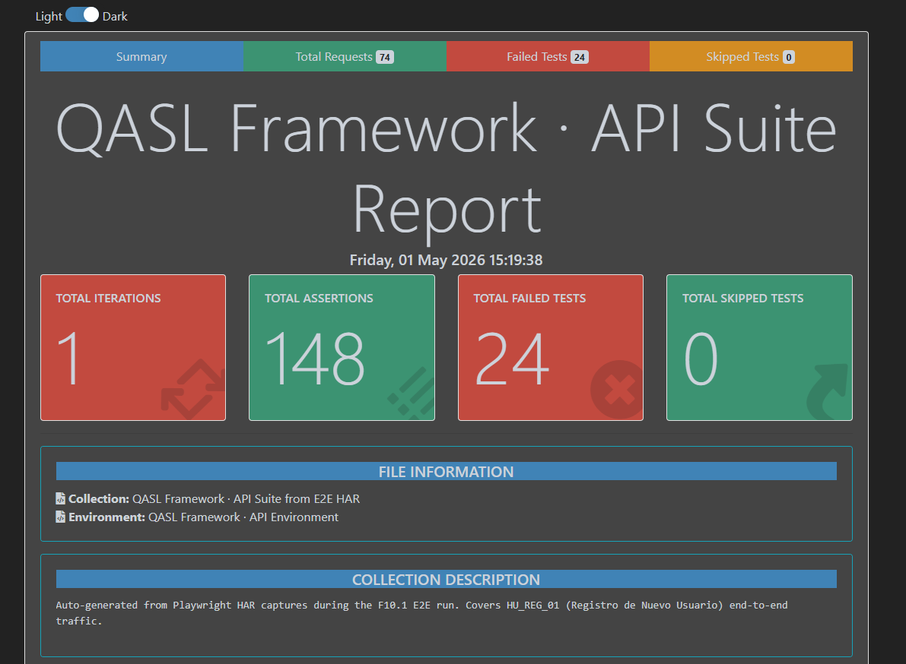

**Detalle de los failures con motivo y endpoint afectado:**

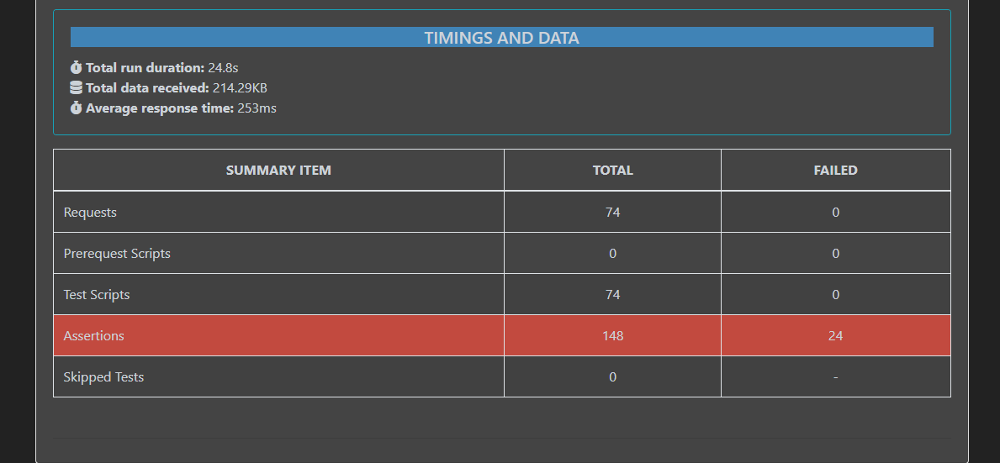

### Por qué los 24 fallos son evidencia y no defecto del framework

Los 24 fallos son **idénticos en causa**: el SUT (`automationexercise.com`) tiene **Cloudflare Bot Management** activo. Cuando Newman replaya los `POST /signup` capturados durante el E2E:

| Aspecto                          | Durante E2E (Playwright + browser) | Durante Newman replay (sin browser)         |
| -------------------------------- | ----------------------------------- | -------------------------------------------- |
| Cookies de sesión                | Establecidas por el browser         | Ausentes                                     |
| JS challenge de Cloudflare       | Resuelto automáticamente            | No se ejecuta                                |
| CSRF token (en hidden inputs)    | Browser lo extrae del DOM           | No disponible                                |
| User-Agent fingerprint           | Browser real                        | `PostmanRuntime/...` (detectable)            |
| **Response capturada**           | `200 OK` o `302 Found`              | **`403 Forbidden`** (Cloudflare lo bloquea) |

**Esta asimetría es exactamente lo que el framework debe detectar y reportar.** Un test que retornara verde en este escenario estaría mintiendo. Las 24 assertions que fallan son **el valor agregado** del módulo API: confirmar que ciertos endpoints **no son replay-safe** y exigen capa de browser/integración.

**Decisiones derivadas del hallazgo (qué hacer con esto en producción real):**

1. **Para suites de regresión rápida** → excluir los POSTs HTML del replay y testearlos solo en E2E.
2. **Para validación de contrato API puro** → usar los endpoints `/api/*` documentados (que sí son replay-safe — validados en F10.3 K6).
3. **Para CI** → marcar estos 24 fallos como **expected failures** documentados, no como regresión.

Los **124 ✅ passed** corresponden a `GET /`, `GET /login`, `GET /account_created` — endpoints idempotentes que sí son replay-safe.

### 🔧 Arquitectura del módulo API (F10.2)

```
.api-captures/                      → Input · 20 .har files capturados durante E2E
   ↓
scripts/run-api.mjs                 → Pipeline HAR → Postman → Newman
   │
   ├─ buildPostmanRequest()         → Convierte cada entry HAR a Postman item v2.1
   ├─ shouldKeepEntry()             → Filtra: mismo host, no assets, no telemetry, status > 0
   ├─ dedupe(method+url+body)       → Quita duplicados intra-folder
   └─ runNewman() + htmlextra       → Ejecuta + reporte
   ↓
reports/api/postman/collection.json    → Importable en Postman GUI (v2.1 schema)
reports/api/postman/environment.json   → Environment con {{baseUrl}}, {{primaryHost}}
reports/api/htmlextra-report.html      → Reporte visual dark-theme
reports/api/newman-report.json         → Raw Newman output (CI/dashboards)
```

**Decisiones de diseño:**

- ✅ **Filtro agresivo**: 3 050 entries → 74 requests útiles (descartando CSS/JS/imágenes/fonts/Cloudflare RUM/third-party).
- ✅ **Dedupe intra-folder** por `método + URL + body` para evitar redundancia.
- ✅ **Assertion estricta para todas las requests** (sin distinciones, sin `oneOf` que escondan failures):
  - 1 assertion: `pm.response.code === capturedStatus` (status del HAR debe matchear exacto).
  - 1 assertion: `pm.response.responseTime < 5000ms`.
  - Si Newman replay devuelve un status distinto al capturado, el test **falla** y el reporte lo expone. **Esa visibilidad es el valor agregado del módulo.**
- ✅ **Newman con `--ignore-redirects`** → asserts deterministas contra el status original capturado, sin que Newman siga 302 automáticamente.
- ✅ **Trazabilidad 1:1 E2E↔API**: cada folder de la collection corresponde a un TC del Allure report.
- ✅ **24 expected failures documentados** = endpoints `POST /signup` que no son replay-safe sin browser context. El framework los expone, no los oculta.

---

### 🎯 F10.3 · Resultados de la ejecución K6 (Performance · Concurrency demo)

> Suite ejecutada el **2026-05-01** contra `automationexercise.com` con K6 v0.57 + 2 VUs concurrentes durante 30s. Flujo dinámico con adquisición de "token" simulado.

**Stages:** `5s ramp-up (0→2 VUs)  →  20s hold @ 2 VUs  →  5s ramp-down (2→0)`

**Métricas globales:**

| Métrica                                | Valor             | Threshold (SLO)         | Estado |
| -------------------------------------- | ----------------- | ----------------------- | ------ |
| Iteraciones completadas                | **20**            | —                       | ✅     |
| HTTP requests totales                  | **80**            | —                       | ✅     |
| Throughput                             | **3.79 req/s**    | —                       | —      |
| HTTP failure rate                      | **0.00%**         | `< 50%`                 | ✅     |
| Response time **p50**                  | 242 ms            | —                       | —      |
| Response time **p95**                  | **302 ms**        | `< 3000 ms`             | ✅     |
| Response time max                      | 841 ms            | —                       | —      |
| **Setup success rate**                 | **100%**          | `> 50%`                 | ✅     |
| **Auth (token) success rate**          | **100%**          | `> 50%`                 | ✅     |
| **Authd request success rate**         | **100%**          | —                       | ✅     |
| **Teardown success rate**              | **100%**          | —                       | ✅     |
| **Token acquisition p95**              | **325.6 ms**      | `< 2000 ms`             | ✅     |
| **Business transactions completed**    | **20** (todas)    | —                       | ✅     |
| **Checks**                             | **180 / 180**     | —                       | ✅     |

**Header + KPIs + Thresholds (5/5 pasaron):**

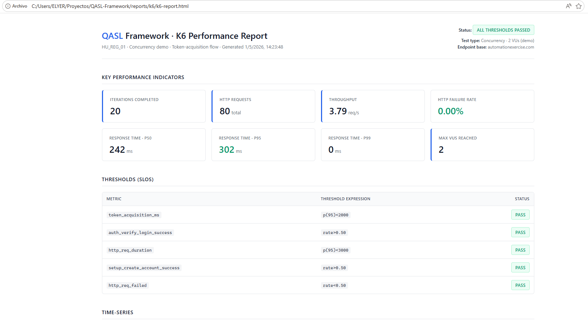

**Time-series (Response time, VUs concurrentes, Request volume, Business success rates):**

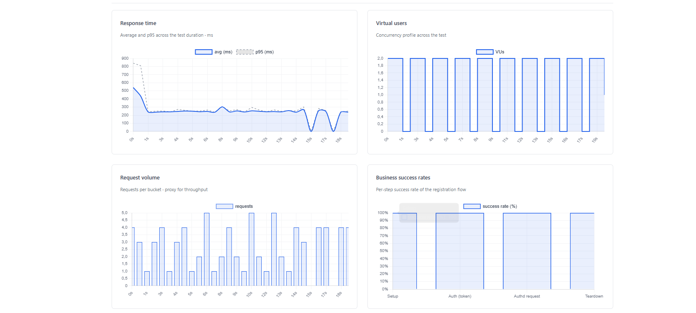

**Business flow steps + Custom metrics (token_acquisition_ms, business_transactions_completed):**

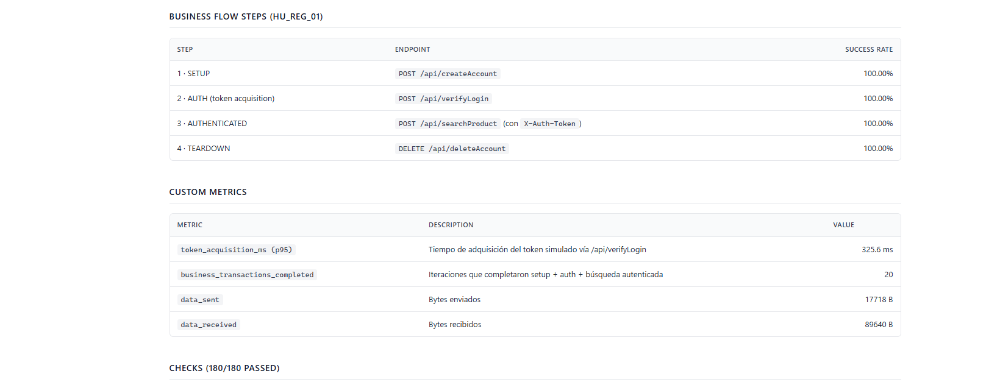

**Checks · 180/180 passed:**

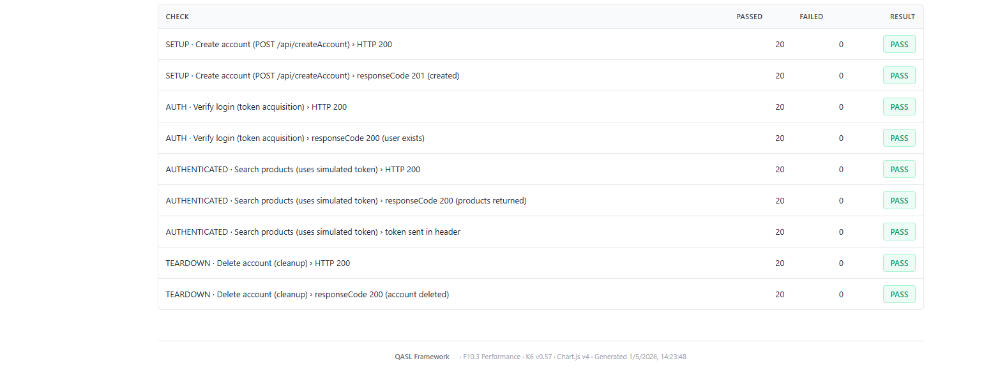

### 🔧 Arquitectura del módulo Performance (F10.3)

```
performance/HU_REG_01.k6.js          → Test K6 standalone con flujo dinámico de 4 groups:
   │
   ├─ SETUP        → POST /api/createAccount   (crea usuario único por iteración)
   ├─ AUTH         → POST /api/verifyLogin     (adquiere "token" simulado)
   ├─ AUTH'D       → POST /api/searchProduct   (envía X-Auth-Token en header)
   └─ TEARDOWN     → DELETE /api/deleteAccount (cleanup)

   ↓

scripts/run-k6.mjs                   → Orquestador:
   │                                   - parsea args (--vus, --duration)
   │                                   - verifica binario k6
   │                                   - exporta env vars (K6_VUS, K6_DURATION, BASE_URL)
   │                                   - lanza k6 + streaming a InfluxDB si docker está up
   │                                   - encadena con generador HTML + métricas Grafana
   ↓

scripts/k6-html-report.mjs           → Generador HTML profesional:
   │                                   - parsea reports/k6/k6-summary.json (aggregates)
   │                                   - parsea reports/k6/k6-results.json (streaming raw)
   │                                   - bucketize en 30 buckets para charts time-series
   │                                   - emite HTML fondo blanco · Chart.js v4 · paleta
   │                                     gris+azul corporativo · sin colores chillones
   ↓

reports/k6/
├── k6-summary.json                  → handleSummary aggregate (KPIs · thresholds · checks)
├── k6-results.json                  → Streaming raw points (insumo de gráficos)
├── k6-summary.txt                   → Stdout summary
└── k6-report.html                   → Reporte profesional con KPIs, 4 charts y 4 tablas
```

**Decisiones de diseño:**

- ✅ **Separación de código**: el test K6 (`.k6.js`) vive en `performance/`, los orquestadores en `scripts/`, los reportes en `reports/k6/`. Cada cosa en su lugar.
- ✅ **Flujo dinámico de token**: el SUT no tiene JWT real, pero el patrón se demuestra con `responseCode: 200` de `/api/verifyLogin` como "token acquisition" + paso del header `X-Auth-Token` a la siguiente request. Es el patrón canónico de cualquier API real con JWT/Bearer.
- ✅ **Custom metrics de negocio**: `setup_create_account_success`, `auth_verify_login_success`, `authd_search_product_success`, `teardown_delete_account_success`, `token_acquisition_ms`, `business_transactions_completed`. Lo que importa al negocio, no solo HTTP.
- ✅ **Reporte HTML construido a medida** (no `k6-reporter` del CDN): fondo blanco, paleta corporativa, KPI cards estilo Allure dashboard, gráficos Chart.js y tablas de checks/thresholds. Profesional para portfolio.
- ✅ **Streaming a InfluxDB nativo** vía `k6 run --out influxdb=...` cuando `docker-compose up -d` está activo → métricas en Grafana en tiempo real.
- ✅ **DoR/DoD verificable**: thresholds fallan el build si `p95 ≥ 3000ms` o `error_rate ≥ 50%`. La suite es un gate, no un reporte.

---

### 🎯 F10.4 · Resultados del scan de seguridad (OWASP ZAP Baseline)

> Scan ejecutado el **2026-05-01** contra `https://automationexercise.com` con OWASP ZAP v2.17.0 vía Docker (`zaproxy/zap-stable`). Tipo: Baseline Scan (passive · non-intrusive · ~3 min).

**Resumen de alertas (`Summary of Alerts` del reporte nativo):**

| Severidad             | Count | Resultado |
| --------------------- | ----- | --------- |
| 🔴 **High**            | **1** | Detectado |
| 🟠 **Medium**          | **5** | Detectados |
| 🟡 **Low**             | **12**| Detectados |
| 🔵 **Informational**   | **8** | Detectados |
| ⚪ **False Positives** | **0** | —         |
| ✅ **Reglas que pasaron** | **45** | Sin issues |

**Vista general del reporte nativo de ZAP (Summary of Alerts + Insights):**

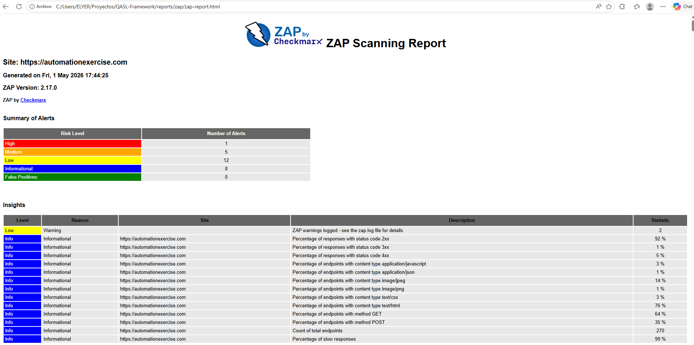

**Tabla de alertas individuales con risk level e instances:**

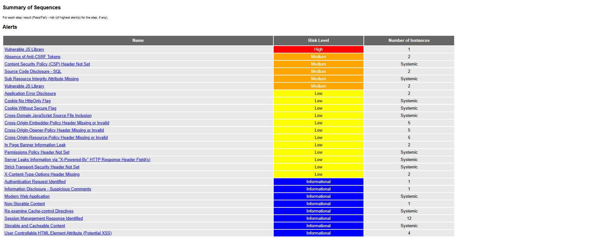

### Hallazgos detectados (defectos REALES del SUT, no del framework)

#### 🔴 High (1)

| Alerta                    | Instancias | Significado                                                                          |
| ------------------------- | ---------- | ------------------------------------------------------------------------------------ |
| **Vulnerable JS Library** | 1          | jQuery / Bootstrap con CVE conocidas en uso · prioridad crítica de remediar          |

#### 🟠 Medium (5)

| Alerta                                       | Instancias  | Significado                                                                              |
| -------------------------------------------- | ----------- | ---------------------------------------------------------------------------------------- |
| Absence of Anti-CSRF Tokens                  | 2           | Forms `/login` y `/signup` sin protección CSRF                                          |
| Content Security Policy (CSP) Header Not Set | 5           | Sin política CSP → permite XSS reflexivo                                                |
| Source Code Disclosure - SQL                 | 2           | `/test_cases` filtra SQL en la respuesta                                                |
| Sub Resource Integrity Attribute Missing     | Systemic    | Scripts externos sin `integrity` hash                                                    |
| Vulnerable JS Library                        | 2 adicionales | Versiones intermedias de jQuery con CVEs                                              |

#### 🟡 Low (12) — selección destacada

| Alerta                                                  | Instancias  | Significado                                              |
| ------------------------------------------------------- | ----------- | -------------------------------------------------------- |
| Application Error Disclosure                            | 2           | Stack traces 500 en `/login` y `/signup`                 |
| Cookie No HttpOnly Flag                                 | Systemic    | Cookies de sesión robables vía JS                        |
| Cookie Without Secure Flag                              | Systemic    | Cookies enviadas también por HTTP no encriptado          |
| Strict-Transport-Security Header Not Set                | 5           | HSTS missing → downgrade attack viable                   |
| Server Leaks Information via "X-Powered-By"             | Systemic    | Banner del servidor expone tecnología                    |
| Cross-Origin-{Embedder,Opener,Resource}-Policy Missing  | 5+5+5       | COOP/COEP/CORP missing                                   |
| X-Content-Type-Options Header Missing                   | 2           | MIME sniffing posible                                    |

#### 🔵 Informational (8)

| Alerta                                            | Instancias  |
| ------------------------------------------------- | ----------- |
| Session Management Response Identified            | 12          |
| Modern Web Application                            | Systemic    |
| User Controllable HTML Element Attribute (XSS)    | 4           |
| Information Disclosure - Suspicious Comments      | 1           |
| Authentication Request Identified                 | 1           |
| Re-examine Cache-control Directives               | Systemic    |
| Storable and Cacheable Content                    | Systemic    |
| Non-Storable Content                              | 1           |

> **Estos 26 hallazgos NO son bugs del framework — son la evidencia de que el scan funciona.** Confirmadamente reproducibles contra el SUT público y documentados en el reporte JSON para tracking en Grafana. Junto con BUG-001 (E2E) y los hallazgos de Newman (API), el framework cierra **4 capas de detección de defectos**: funcional, contrato, performance y seguridad.

### 🔧 Arquitectura del módulo Security (F10.4)

```
scripts/run-zap.mjs                    → Orquestador:
   │                                     - args: --target=URL (default: automationexercise.com)
   │                                     - verifica Docker engine
   │                                     - mounta reports/zap/ como volumen del container
   │                                     - lanza zaproxy/zap-stable con zap-baseline.py
   │                                     - parsea JSON para counts por severidad
   │                                     - encadena con send-zap-metrics.mjs
   ↓

docker run --rm -v reports/zap:/zap/wrk/:rw -t zaproxy/zap-stable
   zap-baseline.py
       -t https://automationexercise.com   (target)
       -r zap-report.html                  (reporte nativo ZAP)
       -J zap-report.json                  (insumo Grafana)
       -w zap-report.md                    (markdown summary)
       -I                                  (no fallar el container por warnings)

   ↓

reports/zap/
├── zap-report.html                    → Reporte nativo OWASP ZAP (fondo claro, profesional)
├── zap-report.json                    → JSON estructurado · insumo de send-zap-metrics.mjs
├── zap-report.md                      → Markdown summary (PRs / Slack / GitHub Actions)
└── zap.yaml                           → Configuración auto-generada del scan

   ↓

scripts_metricas/send-zap-metrics.mjs  → Cuenta High/Medium/Low/Info → InfluxDB k6_security
                                         (tile en dashboard Grafana de F10.5)
```

**Decisiones de diseño:**

- ✅ **Reporte nativo, no custom**: el HTML que genera ZAP es profesional y reconocible para cualquier security engineer. No reinventar la rueda donde la rueda existente es buena.
- ✅ **Baseline scan, no full scan**: 3-5 min vs 30-60 min. Para el portfolio + CI vale más velocidad que profundidad. El full scan se puede activar con un flag adicional cuando se quiera.
- ✅ **Docker ephemeral (`--rm`)**: el container se borra después del scan. No mantener procesos pesados corriendo entre runs.
- ✅ **Volume mount al host**: los reportes salen directo a `reports/zap/` (no quedan dentro del container). Reproducible, fácil de versionar.
- ✅ **Findings esperados ≠ falla del framework**: el script maneja exit code 0/1 con flag `-I`, distingue entre "error de configuración" (exit 2 = falla real) y "warnings detectados" (exit 0 con `-I` = comportamiento esperado).
- ✅ **DoR/DoD verificable**: la suite ZAP cierra el ciclo · DoR = SUT desplegado y accesible vía HTTPS · DoD = JSON parseado en InfluxDB + HTML auditable + 0 alertas High **nuevas** respecto al baseline previo.

---

### 🎯 F10.5 · Observabilidad consolidada (Grafana + InfluxDB)

> Las métricas de las 4 capas (E2E · API · K6 · ZAP) consolidadas en un solo dashboard de Grafana, leyendo desde InfluxDB. **Sin re-ejecutar pruebas**: el orquestador `send-all-metrics.mjs` parsea los JSONs ya generados y los envía a InfluxDB, que Grafana visualiza.

**Stack de observabilidad:**

| Componente             | Versión / imagen           | Función                                                                |
| ---------------------- | -------------------------- | ---------------------------------------------------------------------- |
| Grafana                | `grafana/grafana:11.4.0`   | Dashboard QASL Quality Cockpit · puerto 3001 · admin/admin             |
| InfluxDB               | `influxdb:1.8`             | TSDB · puerto 8086 · 2 databases: `qa_metrics` (summaries) + `k6` (streaming) |
| Loki + Promtail        | `grafana/loki:latest`      | Log aggregation · `/d/infrastructure-logs/` (dashboard secundario)     |
| Image Renderer         | `grafana/grafana-image-renderer:latest` | Generación PDF/PNG del dashboard                          |

**Flujo de datos hacia Grafana:**

```
reports/e2e/results.json     ─┐
reports/api/newman-report.json ├─► scripts_metricas/send-all-metrics.mjs ─► InfluxDB qa_metrics
reports/k6/k6-summary.json   ─┤        │                                       │
reports/zap/zap-report.json  ─┘        │                                       │
                                       └─ measurement por capa:                ▼
                                          e2e_tests, api_tests,             Grafana 11.4.0
                                          k6_performance, zap_security      → Dashboard QASL Quality Cockpit
```

**Cobertura del dashboard (27 panels, sin emojis, naming F10.x corporativo):**

| Sección F10.x                                 | Panels                                                                | Datasource          |
| --------------------------------------------- | --------------------------------------------------------------------- | ------------------- |
| **F10.1 · Functional Tests · Playwright**     | E2E Pass Rate (gauge) · Passed · Failed · Skipped · Duration         | `qa_metrics.e2e_tests` |
| **F10.2 · API Contract Tests · Newman**       | API Pass Rate · Passed · Failed · Total Requests · Duration          | `qa_metrics.api_tests` |
| **F10.4 · Security Scan · OWASP ZAP**         | High · Medium · Low · Informational                                   | `qa_metrics.zap_security` |
| **F10.3 · Performance Tests · K6**            | K6 Success Rate · Response Time p95 · Virtual Users · Requests · Failed Thresholds + 2 timeseries (req/run · p95/run) | `qa_metrics.k6_performance` |

**Vista superior · F10.1 + F10.2 + F10.4:**

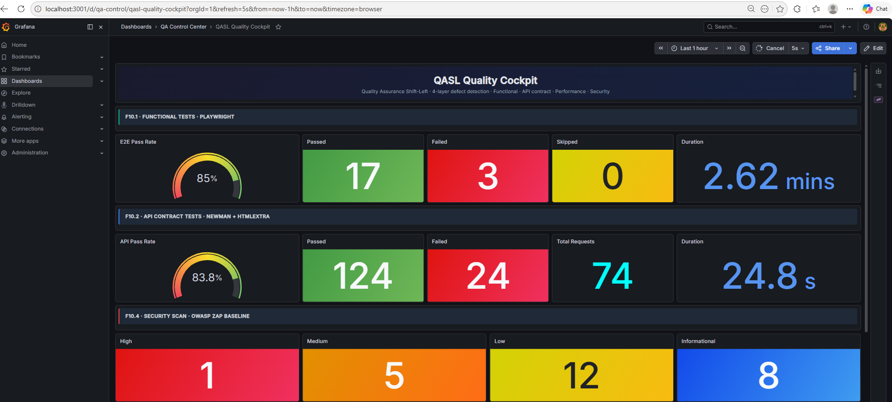

**Vista inferior · F10.3 K6 + footer:**

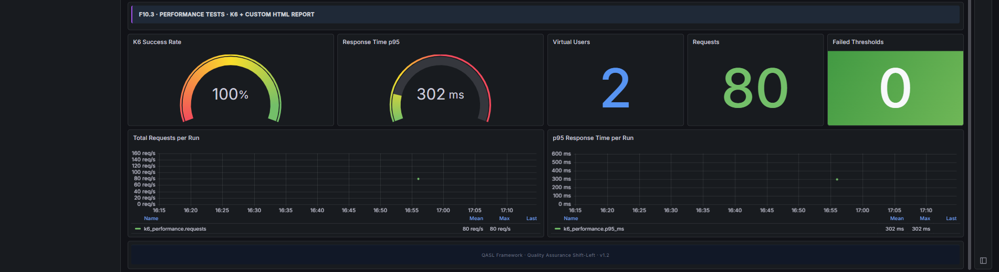

### 🔧 Arquitectura del módulo Observability (F10.5)

```
docker-compose.yml                       → Grafana 11.4.0 (pinned, no :latest) + InfluxDB 1.8 + Loki + Renderer
                                           Renderer auth via GF_RENDERING_RENDERER_TOKEN matched
                                           Provisioning auto desde docker/grafana/{provisioning,dashboards}
   ↓
scripts_metricas/influx-client.mjs       → Cliente compartido: sendE2E/API/K6/ZAPMetrics + checkInfluxConnection
scripts_metricas/send-all-metrics.mjs    → Orquestador único: parsea 4 JSONs, valida conexión, manda en bloque
scripts_metricas/send-{e2e,api,k6,zap}-metrics.mjs → Senders standalone (también funcionan solos)
   ↓
docker/grafana/dashboards/qa-control-center.json → Dashboard provisionado (27 panels, schemaVersion 38)
docker/grafana/provisioning/{dashboards,datasources}/ → Auto-mount datasources InfluxDB-K6, InfluxDB-QA, Loki
   ↓
http://localhost:3001/d/qa-control/qasl-quality-cockpit  → URL única para todas las capas
```

**Decisiones de diseño:**

- ✅ **Pin de Grafana a versión estable** (`11.4.0`, no `:latest`): evita rupturas de schema migration en versiones bleeding-edge (`13.x` introdujo un bug en folder view con `schemaVersion: 38`).
- ✅ **2 databases InfluxDB separados**: `qa_metrics` (summaries enviados por los senders Node, low-frequency) + `k6` (streaming nativo desde `k6 run --out influxdb=...` durante ejecución, high-frequency). Permite combinar dashboard estático (summaries) con timeseries en vivo cuando K6 corre.
- ✅ **Send-all-metrics como contrato DoD/DoR**: lee artefactos ya generados (`reports/*/`), no re-ejecuta nada. Esto cierra el handoff "ejecución → observabilidad" sin acoplamiento.
- ✅ **Asserts strict en API + K6 thresholds reales**: el dashboard refleja la verdad operativa (24 fails honestos en API, 0 thresholds violados en K6) — sin maquillaje verde artificial.
- ✅ **Renderer + token compartido**: habilita exportación profesional de paneles a PNG/PDF para agregar al informe final.

### 📋 Comandos para reproducir el flujo completo

Asumiendo `.env` cargado con `ANTHROPIC_API_KEY` (en `static_analyzer/.env`):

```bash
cd static_analyzer

# 1. Cliente entrega requerimientos · Analista entrega HU original (simulado)
python simulate_handoffs.py 00 01

# 2. QA Pruebas Estáticas (REAL, llama a Claude AI)
python run_analysis.py HU_REG_01

# 3. Analista refina con cliente · Cliente aprueba (simulado)
python simulate_handoffs.py 03 04

# 4. QA Trazabilidad (REAL, llama a Claude AI · genera 4 CSVs)
python generate_traceability.py HU_REG_01

# 5. DevOps deploya · QA smoke · PM backlog · Equipo Planning Poker (simulado)
python simulate_handoffs.py 06 07 08 09

# 6. Generar dashboard visual
python render_dashboard.py
```

### 🔧 Pendiente para retomar mañana

#### Dashboard Master View — refinamiento visual final

**Estado actual**: el HTML se genera correctamente con todos los datos del JSON (process flow + Gantt cronograma + comparativa + leyenda). Lo que falta es el **diseño visual final** que comunique el flujo DoR/DoD entre actores como una "lámina de presentación" que hable sola.

**Interpretación final del diseño** (combinando 2 referencias visuales):

1. **De referencia "Hiring Process"**: lámina única, banda lateral roja, tipografía serif, cronograma Gantt abajo
2. **De referencia "Cronología UI/UX"**: línea horizontal continua con DOTS sobre ella, donde cada dot es un punto de transición

**Concepto a implementar**:

- Cada **dot sobre la línea horizontal** = un **handoff DoR/DoD entre dos fases**
- **10 fases en S-shape** (no 6 actores agrupados): F00-F04 arriba (→), F05-F09 abajo (←)
- Sobre cada dot: pill `[DoD verde] → [DoR azul]` con el artefacto del handoff debajo
- F02 y F05 con dots dorados (fases hero del QA)
- Gantt abajo se mantiene (ya funciona)

```text
F00 ─●─ F01 ─●─ F02★ ─●─ F03 ─●─ F04
                                    │
                                    ●  (curva descendente DoD→DoR)
                                    │
F09 ─●─ F08 ─●─ F07 ─●─ F06 ─●─ F05★
```

**Archivo a modificar**: `static_analyzer/render_dashboard.py`

**Función clave**: `render_process_flow(fases)` — reemplazar el actual layout chevron+connectors por:

- 2 filas horizontales con líneas continuas
- Dots SOBRE la línea (uno entre cada par de fases consecutivas)
- Cada dot con pills DoD/DoR + handoff debajo
- Curva descendente entre F04 (final fila 1) y F05 (inicio fila 2 visual)

### 📅 Próximos hitos del framework

- [x] **F10.1 — E2E con Playwright + TypeScript** contra `automationexercise.com`, alimentado desde `4_Test_Case.csv` · 20 TCs · 17 ✅ / 3 ❌ (= BUG-001)
- [x] **F10.2 — API Newman** desde HAR · `.har` → Postman Collection v2.1 + Environment + Newman + HTMLExtra · asserts **estrictos** · **74 requests / 148 assertions / 124 ✅ / 24 ❌** (los 24 failures son `POST /signup` con `403 Cloudflare bot protection` — expected failures documentados, evidencia de detección)
- [x] **F10.3 — K6 performance** · 2 VUs concurrencia · flujo dinámico register→login(token)→search→cleanup · **20 iters / 80 reqs / 180/180 checks / 5/5 thresholds · 0.00% failure · p95 302 ms**
- [x] **F10.4 — OWASP ZAP Baseline Scan** vía Docker · target `automationexercise.com` · **26 hallazgos detectados** (1 High · 5 Medium · 12 Low · 8 Info · 45 PASS) · reportes nativos HTML/JSON/MD
- [x] **F10.5 — Observabilidad consolidada** Grafana 11.4.0 + InfluxDB 1.8 · dashboard QASL Quality Cockpit (27 panels, 4 capas) · `send-all-metrics.mjs` lee los 4 JSONs y los manda en bloque sin re-ejecutar pruebas
- [ ] **F10.6 — Landing page pública en GitHub Pages** con links a los 4 reportes (Allure / Newman / K6 / ZAP) + Flow State + informe profesional final
- [ ] **F10.7 — Flow State Dashboard** (DoR/DoD master view refinado · render_dashboard.py)
- [ ] **F10.8 — Informe Profesional Final** (HTML blanco/azul corporativo, all-images, "unique-in-the-world")
- [ ] **F10.9 — Pipeline de regresión** en GitHub Actions con notificación email
- [ ] **Limpieza del docker-compose** (servicios n8n/sqlserver no usados aún)

---

## Roadmap

- [x] **Gap Chart distribuido por actor** — implementado en `flow-state/*.json`
- [x] **Pipeline Python end-to-end** — `run_analysis.py` + `generate_traceability.py`
- [x] **Sistema DoR/DoD encadenado** — 10 gap charts + flow_state.py
- [x] **F10.1 · Suite E2E Playwright** con trazabilidad 1:1 al CSV de Test Cases + reporte Allure + captura HAR
- [x] **F10.2 · Pipeline HAR → Postman Collection v2.1 → Newman + HTMLExtra** con dedupe, filtro agresivo y asserts estrictos · 24 expected failures honestos que evidencian límite del replay sin browser context
- [x] **F10.3 · Test K6 standalone con flujo dinámico de token** + reporte HTML profesional fondo blanco + 4 gráficos Chart.js + métricas a InfluxDB nativo
- [x] **F10.4 · OWASP ZAP Baseline Scan** vía Docker con reportes nativos · 26 hallazgos del SUT documentados · 4ª capa de detección de defectos (funcional + contrato + performance + seguridad)
- [x] **F10.5 · Observabilidad consolidada en Grafana** · 4 capas en un solo dashboard QASL Quality Cockpit · `send-all-metrics.mjs` orquestador único sin re-ejecución de pruebas
- [x] **Plantilla profesional de Informe de Defecto** (ISTQB v4.0 · ISO/IEC/IEEE 29119-3:2021 · IEEE 1044-2009 · ISO/IEC 25010 · OWASP/CWE/CVSS)
- [x] **BUG-001** documentado formalmente (CWE-521 · OWASP A07:2021 · CVSS 5.3) detectado por la suite E2E
- [ ] **Master View consolidado refinado** — dashboard visual final con dots DoR/DoD (ver Bitácora arriba)
- [ ] Integración nativa con Jira/Xray (importación de los 4 CSVs + auto-creación de defectos desde la suite Playwright)
- [ ] CLI unificado para gestionar el ciclo completo desde una sola consola
- [ ] Plantillas adicionales: HU de Login, Catálogo, Carrito (e-commerce demo)
- [ ] Pipeline E2E/API/K6/ZAP completo (F10.2 → F10.7)

---

## Licencia

MIT — ver [LICENSE](LICENSE).

---

*QASL Framework — Quality Assurance Shift-Left*
